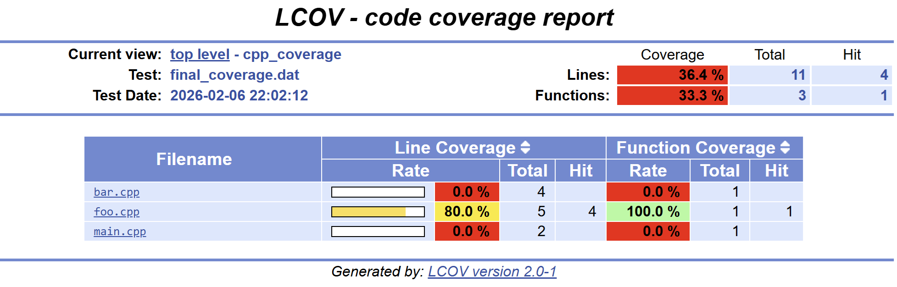

# Basic code coverage computation for C++ using Bazel

## Goal

Show how to compute the code coverage in Bazel that is relevant for a specific target using a very simple example.

For the moment this example is applicable to Linux and using gcc.

## About the example

In this example we have declared 5 targets. A binary that depends on two libraries and a test that also depend on two libraries but only one common library with the binary.
Our application that we want to build and analize the code coverage is the `main`target.

You can see it better in the picture below:

<!--
digraph G {
  "foo(lib)" -> "main(bin)" [dir = back]
  "bar(lib)" -> "main(bin)" [dir = back]
  "foo(lib)" -> "foo_test(test)" [dir = back]
  "catch2(lib)" -> "foo_test(test)" [dir = back]
}
-->


What we want to show in this example is how to compute the code coverage considering two steps, the initial/baseline coverage, and the coverage computed when running the tests. To simplify the example we will only have one test. Having more than one test would require additionally to aggregate the coverage information for all tests.

The measures used for coverage that we will focus and we want to obtain are:

* Line coverage
* Function coverage
* Branch coverage
* Condition coverage

### Computing code coverage with Bazel

The first command that intuitively we would execute is:

```bash
bazel coverage //:foo_test
```

This will run the `foo_test` collecting the coverage information and generating a `.dat` file. Then we can run `genhtml` passing the output file to generate an html report.

```bash
genhtml --branch-coverage --output-directory coverage-report bazel-testlogs/foo_test/coverage.dat
```

Considering that we are interested in the coverage of the `main` target and all of its dependencies, we would expect to find in the report the files of the `foo`, `bar`, and `main` target. We are not interested on the coverage of the `foo_test` as well as the `catch2`.

Let's see what we have:


In the generated html only the `foo` target appears, showing a line coverage of 80% but in reality is much lower because `main` and `bar` have not been considered. Regarding the coverage measures we see line coverage, function coverage, and branch coverage, but no condition coverage.

Let's summarize per target:

* [x] `foo` should appear
* [ ] `bar` should appear
* [ ] `main` should appear
* [x] `foo_test` should not appear
* [x] `catch2` should not appear

And per feature:

* [x] Line coverage
* [x] Function coverage
* [x] Branch coverage
* [ ] Condition coverage

As we can see in the related Bazel github issues, Bazel is not supporting baseline coverage and this is why the report is wrong.

### Workaround to get better results

We can workaround the problem mentioned above doing the follow:

First we clean the bazel-out to make sure that we do not have any previous coverage file:

```bash
bazel clean --expunge
```

Then we compile the target for what we want to know the coverage adding the additional `--collect_code_coverage` and `--remote_download_all` parameters:

```bash
bazel build //:main --collect_code_coverage --remote_download_all
```

After that, we run lcov from the root of the workspace to generate the `coverage_baseline.dat`:

```bash
lcov -c --follow --branch-coverage -i -d bazel-out/ -o coverage_baseline.dat
```

This command will search for the coverage files generated during the compilation and will aggregate the information into the `coverage_baseline.dat` file.

Once we have the baseline coverage, we run the tests with `bazel coverage` to get the coverage information when running the tests:

```bash
bazel coverage //:foo_test
```

This will generate the `coverage.dat` file that we saw above.

If you open in a file editor `coverage_baseline.dat` and `coverage.dat` you will see that the first one has `/proc/self/cwd/` pre appended in all the file paths. In order to be able to combine it with the file generated from `bazel coverage` need to unify the paths. We can do it with:

```bash
sed -i 's,/proc/self/cwd/,,g' coverage_baseline.dat
```

Now we can combine both files with the following command to get the final coverage file.

```bash
lcov --branch-coverage -a coverage_baseline.dat -a bazel-testlogs/foo_test/coverage.dat -o final_coverage.dat
```

Like we did before we can now run `genhtml` to generate an html report.

```bash
genhtml --branch-coverage --output-directory coverage-report final_coverage.dat
```

Let's see now what we get in the report:



In the generated html `foo`, `bar` and `main` targets appear, showing a line coverage of 36.4%, much lower than before but now much more correct because `bar` and `main` targets are considered. Regarding the coverage measures we still see line coverage, function coverage, and branch coverage, but no condition coverage.

Let's summarize per target:

* [x] `foo` should appear
* [x] `bar` should appear
* [x] `main` should appear
* [x] `foo_test` should not appear
* [x] `catch2` should not appear

And per feature:

* [x] Line coverage
* [x] Function coverage
* [x] Branch coverage
* [ ] Condition coverage

## Related links

* [Irina Iancu - Collecting Code Coverage With Bazel - BazelCon 2018](https://www.youtube.com/watch?v=P51Rgcbxhyk)

## Related Bazel github issues

* [#5716: Support baseline coverage (open)](https://github.com/bazelbuild/bazel/issues/5716)
* [#8324: baseline_coverage.dat is not a valid lcov file (closed as duplicate of #5716)](https://github.com/bazelbuild/bazel/issues/8324)
* [#12142: IncompatibleMergeException in branch coverage for C++ headers (fixed starting from Bazel 9 LTS)](https://github.com/bazelbuild/bazel/issues/12142)
