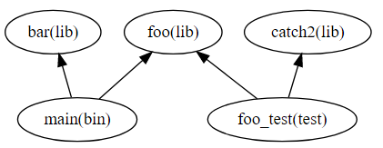
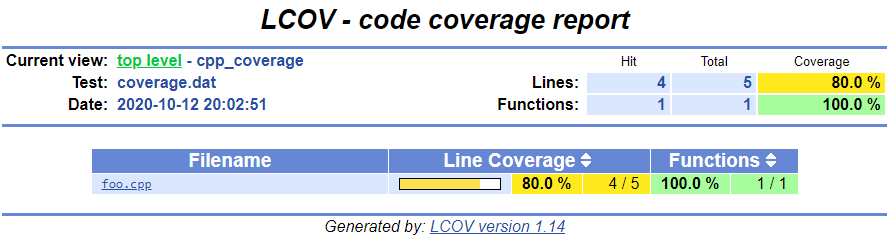

# Basic code coverage computation for C++ using Bazel

## Goal

Show how to compute the code coverage in Bazel that is relevant for a specific target using a very simple example.

For the moment this example is applicable to Linux and using gcc.

## About the example

In this example we have declared 5 targets. A binary that depends on two libraries and a test that also depend on two libraries but only one common library with the binary.
Our application that we want to build and analize the code coverage is the `main`target.

You can see it better in the picture below:

<!--
digraph G {
  "foo(lib)" -> "main(bin)" [dir = back]
  "bar(lib)" -> "main(bin)" [dir = back]
  "foo(lib)" -> "foo_test(test)" [dir = back]
  "catch2(lib)" -> "foo_test(test)" [dir = back]
}
-->


What we want to show in this example is how to compute the code coverage considering two steps, the initial/baseline coverage, and the coverage computed when running the tests. To simplify the example we will only have one test. Having more than one test would require additionally to aggregate the coverage information for all tests.

The measures used for coverage that we will focus and we want to obtain are:

* Line coverage
* Function coverage
* Branch coverage
* Condition coverage

The first command that intuitively we would execute is:

```bash
bazel coverage //:foo_test
```

This will run the `foo_test` collecting the coverage information and generating a `.dat` file. Then we can run `genhtml` passing the output file to generate an html report.

```bash
genhtml --output-directory coverage-report bazel-testlogs/foo_test/coverage.dat
```

Considering that we are interested in the coverage of the `main` target and all of its dependencies, we would expect to find in the report the files of the `foo`, `bar`, and `main` target. We are not interested on the coverage of the `foo_test` as well as the `catch2`.

Let's see what we have:



In the generated html only the `foo` target appears, showing a line coverage of 80% but in reality is much lower because `main` and `bar` have not been considered.

Let's summarize:

- [x] `foo` should appear
- [ ] `bar` should appear
- [ ] `main` should appear
- [x] `foo_test` should not appear
- [x] `catch2` should not appear

## Related links

* [Irina Iancu - Collecting Code Coverage With Bazel - BazelCon 2018](https://www.youtube.com/watch?v=P51Rgcbxhyk)

## Related Bazel github issues

* [#5716: Support baseline coverage (open)](https://github.com/bazelbuild/bazel/issues/5716)
* [#8324: baseline_coverage.dat is not a valid lcov file (closed as duplicate of #5716)](https://github.com/bazelbuild/bazel/issues/8324)
